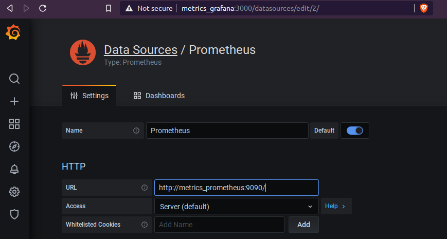
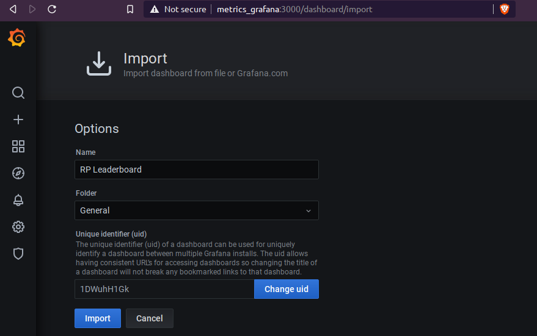

# ROCKETPOOL - SMARTNODE

##### -=# Metrics Edition #=-

Original README of Rocketpool project https://github.com/rocket-pool/smartnode/blob/master/README.md

***NOTE*** running metrics consume additional CPU (especially whole network data like the leaderboard) so don't run this on machines with resource limitations.

---


## Installation Instructions
***WARNING*** Proceed with caution. Do *not* go around downloading random stuff from random github repositories and expect your machine to remain in one piece.  The code will work of course, but be cautious when doing stuff like this!  I am not responsible for what this software may or may not do.  Anything that happens on your machine is your responsibility.

This is intended to work with standard installation of Rocketpool.  Follow the usual rocketpool installation process:
https://github.com/rocket-pool/smartnode-install

Select Lighthouse as ETH2 client.  It should be possible to run metrics using Prysm but it is not tested and some configuration will need changing.

Run the commands:

```bash
wget https://github.com/kidkal/smartnode/releases/download/v0.0.1/metrics.tar.bz2
tar xfvj metrics.tar.bz2 --directory ~/.rocketpool
cd ~/.rocketpool/metrics
./rocketpool-metrics service start
```

This will:

- download the prebuilt executable with various configuration files
- extract the files to `~/.rocketpool/metrics`
- run the metrics docker containers:
	- `metrics_api`
	- `metrics_prometheus`
	- `metrics_grafana`

Log on to grafana `http://metrics_grafana:3000/` on the host running metrics container or `http://<your-ip>:3000/` if accessing remotely.  The default login is `admin` and default password is `admin`.


On the left bar, select Configuration, Data Sources, Add data source

Select Prometheus, set URL: `http://metrics_prometheus:9090/`, Save & Test



On the left bar, select Create, Import, Upload JSON file

Select the file `~/.rocketpool/metrics/grafana/rp-leaderboard.json`



Click Import.  The Rocketpool Dashboard should appear (see [To Do](#todo) below for comments).

### Optional
#### Enable metrics for geth node
Add parameters to `~/.rocketpool/chains/eth1/start-node.sh`

`--metrics --metrics.addr 0.0.0.0 --metrics.port 6060 --pprof.addr 0.0.0.0`

A sample script is available at [config/chains/eth1/start-node.sh]

#### Enable metrics for beacon node
Add parameters to `~/.rocketpool/chains/eth2/start-beacon.sh` lighthouse execution

`--metrics --metrics-address 0.0.0.0 --metrics-port 5053 --http-allow-origin '*'`

A sample script is available at [config/chains/eth2/start-beacon.sh]

#### Enable metrics for validator
Add parameters to `~/.rocketpool/chains/eth2/start-validator.sh` lighthouse execution

`--metrics --metrics-address 0.0.0.0 --metrics-port 5064 --metrics-allow-origin '*'`

A sample script is available at [config/chains/eth1/start-validator.sh]

#### Use Prysm as ETH2 client
Update `~/.rocketpool/metrics/settings.yml`

#### Use external ETH1 or ETH2 clients
Update `~/.rocketpool/metrics/settings.yml`


## Available Metrics
The following metrics are available at the URL `http://metrics_api:2112/metrics` for your own scraping process or promql queries

```
rocketpool_minipool_count{status}
rocketpool_minipool_queue_count{depositType}
rocketpool_network_balance_eth{unit}
rocketpool_network_fee_rate{range}
rocketpool_network_updated_block
rocketpool_node_minipool_count{address,timezone,trusted}
rocketpool_node_score_eth{address,rank}
rocketpool_node_score_hist_eth{le}
rocketpool_node_score_hist_eth_count
rocketpool_node_score_hist_eth_sum
rocketpool_node_total_count
rocketpool_settings_flags_bool{flag="AssignDepositEnabled"}
rocketpool_settings_flags_bool{flag="DepositEnabled"}
rocketpool_settings_flags_bool{flag="MinipoolWithdrawEnabled"}
rocketpool_settings_flags_bool{flag="NodeDepositEnabled"}
rocketpool_settings_flags_bool{flag="NodeRegistrationEnabled"}
rocketpool_settings_flags_bool{flag="ProcessWithdrawalEnabled"}
rocketpool_settings_flags_bool{flag="SubmitBalancesEnabled"}
rocketpool_settings_maximum_pool_eth
rocketpool_settings_minimum_deposit_eth
```


## Build Instructions
Install the prerequisite development tools like `git`, `go` and `docker`

```sh
git clone https://github.com/kidkal/smartnode.git
cd smartnode
git checkout metrics
./build.sh
```

This will:

- build the `rocketpool` service executable, wrap it into a docker image with label `kidkal/rocketpool:metrics`
- build the client executable `rocketpool-cli`
- create the compressed package `metrics.tar.bz2` with client executable renamed to `rocketpool-metrics` and config files from `config`


## Change Description
Description of changes from Rocketpool Smartnode project v0.0.9

### Rocketpool Client

The client executable `rocketpool-metrics` works the same way as normal `rocketpool` client but with the following alterations:

- picks up configuration from current directory `$PWD`.  This is similar behaviour to `docker-compose` that picks up the `docker-compose.yml` file from the current directory.  This behaviour is overridable with parameter `--config`
- the usual Rocketpool commands that uses the node's wallet are not working because it does not have access to the wallet and password, normally located `~/.rocketpool/data`.  It is possible to copy the wallet and password files to `~/.rocketpool/metrics/data`.
- add command `rocketpool-metrics minipool leader` : outputs a list rocketpool minipools and their running rewards and penalties in CSV format
- add command `rocketpool-metrics node leader` : outputs a list rocketpool nodes and the running rewards and pentalties of its top 2 minipools in CSV format

### Rocketpool Server 
Docker image `kidkal/rocketpool:metrics`

- ability to run Rocketpool metrics service as configured by `docker-compose.yml`
- add metrics end point at `http://metrics_api:2112/metrics` for Prometheus scraping
- add most data that can be scraped from Rocketpool contracts
- include histogram of node scores
- include all nodes including those without validators


## <a name="todo"></a>To Do

- fix ethClient.dial connect: cannot assign requested address issue
- refactor metrics code
- improve Rocketpool dashboard
